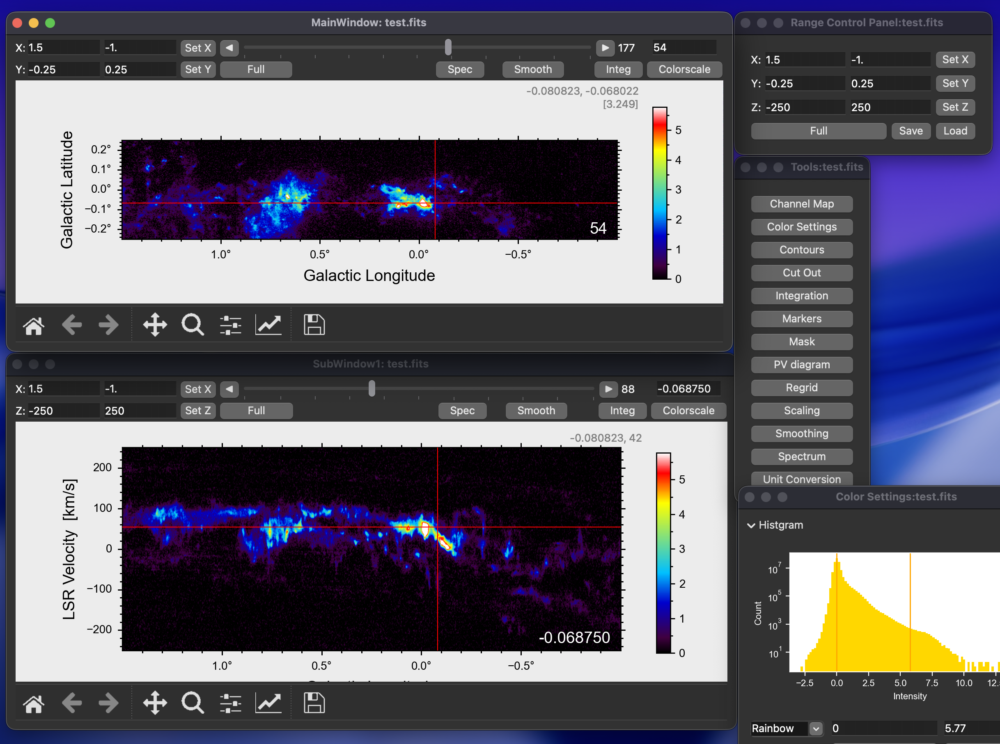
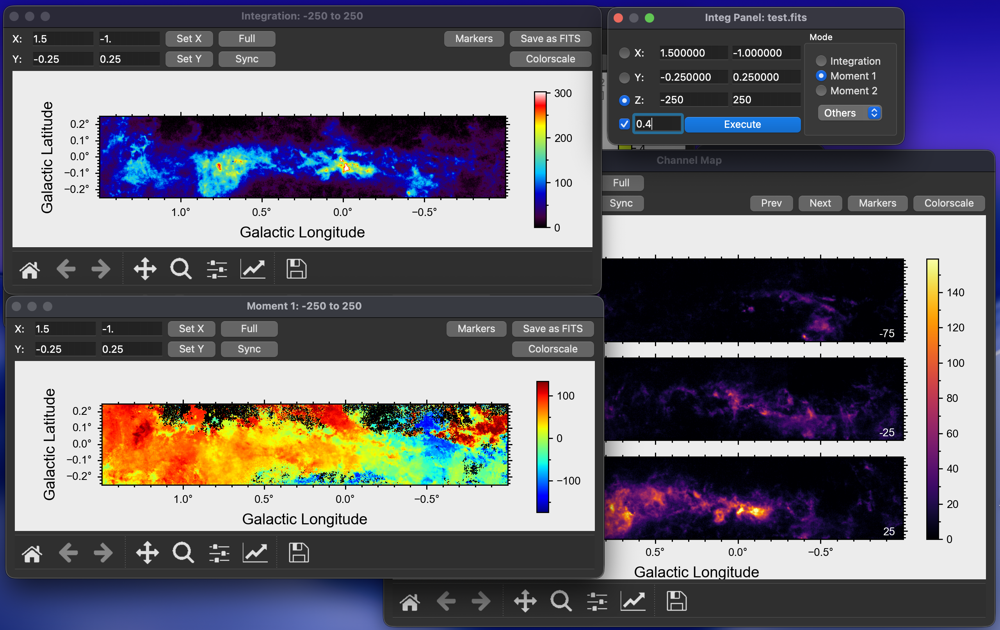
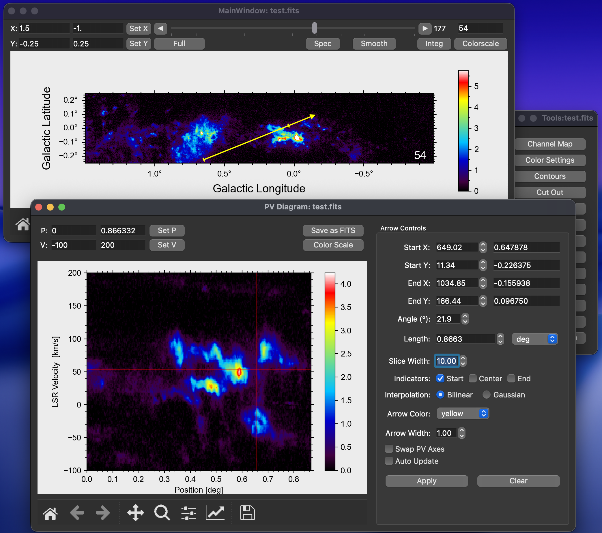
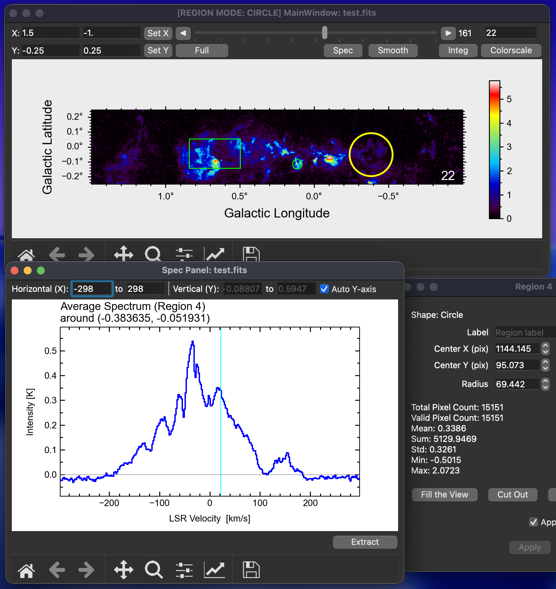
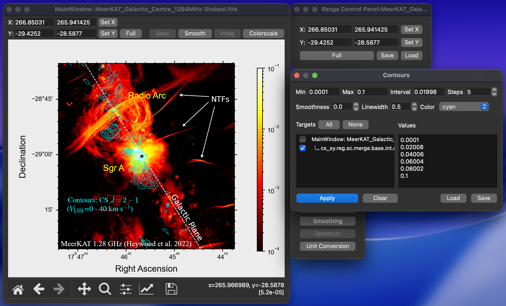

# Takefits

Takefits is a GUI-based astronomical FITS viewer and analysis tool developed by Shunya Takekawa.  
This is an initial public pre-release version.

## Requirements
- Python 3.12 or later

## Setup
It is recommended to use a virtual environment:

```bash
python -m venv venv
source venv/bin/activate    # On Windows: venv\Scripts\activate
pip install -r requirements.txt
```

## Usage

```bash
python main.py [path/to/fitsfile]
```

## Features

Takefits provides a comprehensive set of tools for radio astronomy data analysis.

### 1. Multi-View Cube Visualization
Visualize 3D FITS data cubes with synchronized XY, XZ, and ZY planes.


### 2. Moment Maps & Channel Maps
Calculate moment maps (Integrated Intensity, Velocity Field, Velocity Dispersion) and create tiled channel maps.


### 3. Interactive P-V Diagram
Interactively draw slice lines on the map to generate Position-Velocity (P-V) diagrams instantly.


### 4. Spectrum Analysis
Extract spectra from a single pixel or calculate the average spectrum within selected regions (Circle, Rectangle, Ellipse, Cube).


### 5. Publication-Quality Figures
Generate publication-quality figures directly from the GUI.
- **Contours**: Overlay customizable contours with adjustable levels.
- **Markers**: Annotate images with symbols, lines, and text.
- **Beam Size**: Visualize the HPBW ellipse.
- **Vector Export**: Save plots in PDF, EPS, or SVG formats.


### Other Tools
- **Regridding**: Resample data to a new grid, different coordinate system, or a FITS template.
- **Smoothing**: Apply Gaussian and Boxcar spatial smoothing.
- **Masking**: Apply threshold-based or external masks to data.
- **Cutout**: Crop data cubes based on regions or coordinate ranges.


## Research use
This is a pre-release version.  
If you use this software for scientific research or publications,  
please cite the following GitHub repository:
https://github.com/s-takekawa/takefits

## Contact
shunya_at_kanagawa-u.ac.jp